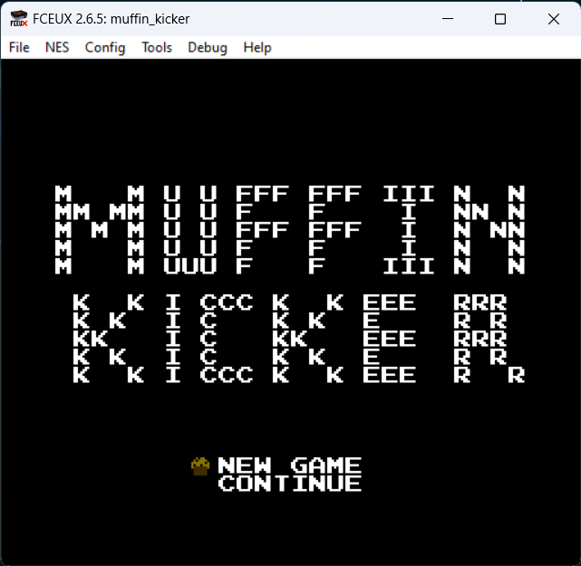

# Muffin Kicker

## Details

This was a reverse challenge given at [DamCTF 2023](https://ctftime.org/event/1872). It provided a [INES file](https://www.nesdev.org/wiki/INES) that contained a NES game and a server to connect to. The server was running the game in a text interface and behaved like the provided file.

## Overview

The tool that I use from now on is [FCEUX](https://fceux.com/web/home.html), a NES emulator that also has debugging capabilities.



Opening the game we get 2 options:
- Start a new game
- Continue

Starting the game just loads the game. The challenge description had something about the player not being implemented, so we are stuck on this screen.

The continue screen requires a password to load a level. Entering an incorrect password just shows the same screen again. There is no submit button, the password is checked as soon as you enter all characters.


At this point I wanted to see where the input is stored in the memory. I used the Hex Editor functionallity of FCEUX to see the memory in real time. Entering and deleting characters in the password field shows that the input is stored in the memory at `$302-$317`. `$301` appears to be the length of the input.

The input is stored as numbers between `$00` and `$3f`. The letters are converted into numbers in the order they appear on the screed. A -> `$00`, B -> `$01` ... / -> `$3f`


Using the debugger, I set a breakpoint for every read in the input range. It stopped at the following sequence of instructions:
```
 00:8273: 4A        LSR
 00:8274: 76 00     ROR $00,X
 00:8276: B0 0D     BCS $8285
 00:8278: 4A        LSR
 00:8279: D0 F9     BNE $8274
 00:827B: 88        DEY
 00:827C: 30 11     BMI $828F
 00:827E: B9 02 03  LDA $0302,Y @ Y is initialized with 14
 00:8281: 09 40     ORA #$40
 00:8283: D0 EE     BNE $8273
 00:8285: CA        DEX
 00:8286: 48        PHA
 00:8287: A9 80     LDA #$80
 00:8289: 95 00     STA $00,X
 00:828B: 68        PLA
 00:828C: 4C 78 82  JMP $8278
 00:828F: EA        NOP
```
It takes the first 6 bits of input code and concatenates the bytes in a single result in the `$00`-`$0f` range. I later realised this is basically a bse64 decoder. So far, the program just decodes the input and stores it for the next operations.

Right after the decoding loop finishes, the next code is executed
```
loop:
 00:8290: A5 01     LDA $01
 00:8292: 0A        ASL
 00:8293: A5 0F     LDA $0F
 00:8295: 2A        ROL
 00:8296: 49 FF     EOR #$FF
 00:8298: 85 0F     STA $0F
 00:829A: A5 0E     LDA $0E
 00:829C: 2A        ROL
 00:829D: 49 EE     EOR #$EE
 00:829F: 85 0E     STA $0E
 00:82A1: A5 0D     LDA $0D
 00:82A3: 2A        ROL
 00:82A4: 49 DD     EOR #$DD
 00:82A6: 85 0D     STA $0D
 00:82A8: A5 0C     LDA $0C
 00:82AA: 2A        ROL
 00:82AB: 49 CC     EOR #$CC
 00:82AD: 85 0C     STA $0C
 00:82AF: A5 0B     LDA $0B
 00:82B1: 2A        ROL
 00:82B2: 49 BB     EOR #$BB
 00:82B4: 85 0B     STA $0B
 00:82B6: A5 0A     LDA $0A
 00:82B8: 2A        ROL
 00:82B9: 49 AA     EOR #$AA
 00:82BB: 85 0A     STA $0A
 00:82BD: A5 09     LDA $09
 00:82BF: 2A        ROL
 00:82C0: 49 99     EOR #$99
 00:82C2: 85 09     STA $09
 00:82C4: A5 08     LDA $08
 00:82C6: 2A        ROL
 00:82C7: 49 88     EOR #$88
 00:82C9: 85 08     STA $08
 00:82CB: A5 07     LDA $07
 00:82CD: 2A        ROL
 00:82CE: 49 77     EOR #$77
 00:82D0: 85 07     STA $07
 00:82D2: A5 06     LDA $06
 00:82D4: 2A        ROL
 00:82D5: 49 66     EOR #$66
 00:82D7: 85 06     STA $06
 00:82D9: A5 05     LDA $05
 00:82DB: 2A        ROL
 00:82DC: 49 55     EOR #$55
 00:82DE: 85 05     STA $05
 00:82E0: A5 04     LDA $04
 00:82E2: 2A        ROL
 00:82E3: 49 44     EOR #$44
 00:82E5: 85 04     STA $04
 00:82E7: A5 03     LDA $03
 00:82E9: 2A        ROL
 00:82EA: 49 33     EOR #$33
 00:82EC: 85 03     STA $03
 00:82EE: A5 02     LDA $02
 00:82F0: 2A        ROL
 00:82F1: 49 22     EOR #$22
 00:82F3: 85 02     STA $02
 00:82F5: A5 01     LDA $01
 00:82F7: 2A        ROL
 00:82F8: 49 11     EOR #$11
 00:82FA: 85 01     STA $01
 00:82FC: C6 00     DEC $00
 00:82FE: D0 90     BNE $8290 @ loop
```

This code is a bit more complicated. It takes the decoded input, makes some rotations and XORs it with some constants. The constants are a sequence of numbers between `$11` and `$FF`. The operations are executed in-place in the `$01`-`$0f` range.

The loop is executed `[$00]` times. This means that we can manipulate how many times this loop is executed. Setting the first byte to `$00` will make the loop execute 256 time. I will later set it to `$01` to make the computations easier.

Then the code adds the last 12 bytes of the input and stores them in `X:A`. But for each number it adds an extra 1. So in the end, the value in `X:A` is `sum($04-$0f)+12`.

The sum is then used for an integrity check. The sum has to be equal to the values stored in `$01:$02`. Again, this is controlled by out input.
```
 00:8300: A9 00     LDA #$00
 00:8302: A2 00     LDX #$00
 00:8304: A0 0C     LDY #$0C
add_loop:
 00:8306: 38        SEC
 00:8307: 79 03 00  ADC $0003,Y @ $0102 = #$39
 00:830A: 90 01     BCC $830D
 00:830C: E8        INX
 00:830D: 88        DEY
 00:830E: D0 F6     BNE $8306 add_loop
integrity_check:
 00:8310: A4 03     LDY $03 = #$00
 00:8312: 85 03     STA $03 = #$00
 00:8314: 0A        ASL
 00:8315: A5 03     LDA $03 = #$00
 00:8317: 2A        ROL
 00:8318: 88        DEY
 00:8319: D0 F7     BNE $8312 add
 00:831B: C5 01     CMP $01 = #$00
 00:831D: D0 07     BNE $8326
 00:831F: E4 02     CPX $02 = #$00
 00:8321: D0 03     BNE $8326
 00:8323: 4C A6 87  JMP $87A6 @ load_level
```

Right after this check, the range some of the values are copied into `$0318-$0320`. Putting yet another breakpoint for reads on this range showed that only the value copied from `$04` is accessed. I tried setting this to `$00` and it loaded the first level. Changing it to `$01` loaded anoter. The description of the challenge mentioned something about the 5th level. So I tried setting it to `$04` and it worked. I got the flag.

This was done editing the CPU flags while stepping through the program, so now I needed to find a way to do it from the input. I wrote a (pretty ugly) z3 script to get me an input to load the level.


## Solution

```python
from z3 import *

values = [BitVec(f"byte-{i}", 16) for i in range(16)] # 16-bit vectors to be able to add 8-bit values into a 16-biy one
values2 = [BitVec(f"byte2-{i}", 16) for i in range(16)]
su = BitVec("sum", 16)

s = Solver()

for i in range(16):
	s.add(values[i] >= 0)
	s.add(values[i] <= 0xff)
	s.add(values2[i] >= 0)
	s.add(values2[i] <= 0xff)

s.add(values[15] & 0x7 == 0) # Not sure why, but the last 6 bits seem to be always 0
s.add(values[0] == 1)

# One iteration ($00 = 1)
s.add(values2[0xf] == (((values[0x01] >> 7) + (values[0xf] << 1)) ^ 0xff) & 0xff)
s.add(values2[0xe] == (((values[0x0f] >> 7) + (values[0xe] << 1)) ^ 0xee) & 0xff)
s.add(values2[0xd] == (((values[0x0e] >> 7) + (values[0xd] << 1)) ^ 0xdd) & 0xff)
s.add(values2[0xc] == (((values[0x0d] >> 7) + (values[0xc] << 1)) ^ 0xcc) & 0xff)
s.add(values2[0xb] == (((values[0x0c] >> 7) + (values[0xb] << 1)) ^ 0xbb) & 0xff)
s.add(values2[0xa] == (((values[0x0b] >> 7) + (values[0xa] << 1)) ^ 0xaa) & 0xff)
s.add(values2[0x9] == (((values[0x0a] >> 7) + (values[0x9] << 1)) ^ 0x99) & 0xff)
s.add(values2[0x8] == (((values[0x09] >> 7) + (values[0x8] << 1)) ^ 0x88) & 0xff)
s.add(values2[0x7] == (((values[0x08] >> 7) + (values[0x7] << 1)) ^ 0x77) & 0xff)
s.add(values2[0x6] == (((values[0x07] >> 7) + (values[0x6] << 1)) ^ 0x66) & 0xff)
s.add(values2[0x5] == (((values[0x06] >> 7) + (values[0x5] << 1)) ^ 0x55) & 0xff)
s.add(values2[0x4] == (((values[0x05] >> 7) + (values[0x4] << 1)) ^ 0x44) & 0xff)
s.add(values2[0x3] == (((values[0x04] >> 7) + (values[0x3] << 1)) ^ 0x33) & 0xff)
s.add(values2[0x2] == (((values[0x03] >> 7) + (values[0x2] << 1)) ^ 0x22) & 0xff)
s.add(values2[0x1] == (((values[0x02] >> 7) + (values[0x1] << 1)) ^ 0x11) & 0xff)
s.add(values2[0x3] == 1)

s.add(su == values2[0x4] + values2[0x5] + values2[0x6] + values2[0x7] + values2[0x8] + values2[0x9] + values2[0xa] + values2[0xb] + values2[0xc] + values2[0xd] + values2[0xe] + values2[0xf] + 12)
s.add(values2[0x1] == ((su << 1) | ((su&0xff) >> 7)) & 0xff)
s.add(values2[0x2] == su >> 8)
s.add(values2[0x4] == 0x4)

print(s.check())
m = s.model()

alphabet = "ABCDEFGHIJKLMNOPQRSTUVWXYZabcdefghijklmnopqrstuvwxyz0123456789+/"

# This is just base64 encode
bn = ""
for i in range(16):
	val = m[values[i]].as_long()
	bn += f"{val:08b}"

bb = [int(bn[i:i+6],2) for i in range(0,len(bn), 6)]

print("".join([alphabet[x] for x in bb])) # AQ+UGSBUSEQygwqCGREIgA
```

Other resources: [https://www.nesdev.org/](https://www.nesdev.org/)
