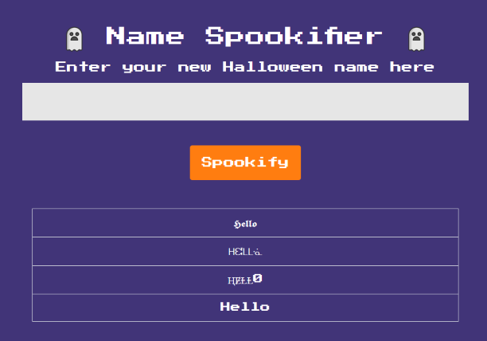

# Spookifier

## Description

There's a new trend of an application that generates a spooky name for you. Users of that application later discovered that their real names were also magically changed, causing havoc in their life. Could you help bring down this application?

## Solution

For this challenge we get a website and the code behind it. Visiting the site we get a prompt that will transform out input into similar "spooky" characters.



Following the output source in code we go through the following template:
```html
<table class="table table-bordered">
	<tbody>
		${output}
	</tbody>
</table>
```

Suspecting a template injection attack and seeing that the forth line doesn't modify our input, only the font, I tried a basic template injection test `${1+1}` The result was a 2 being printed on the page.
At this point I tried to send
```python
${open('/flag.txt','r').read()}
```

But it didn't work. Testing it locally, I found out that the comma character is not in the character whitelist. I tried without the read parameter, as it is the default open mode in python.
```python
${open('/flag.txt').read()}
```

This got the flag `HTB{t3mpl4t3_1nj3ct10n_1s_$p00ky!!}`
